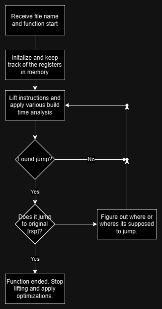

# Project Overview:
Mergen is a tool engineered to convert Assembly code into LLVM Intermediate Representation (IR).
This tool is designed for:
- The deobfuscation or devirtualization of obfuscated binary code
- The enhancement of the reverse engineering process, making it more efficient and effective, especially for complex software systems.

## Core Objectives:

### Deobfuscation

### Devirtualization

### Optimization

## Diagram


## Example

This is our target program

```cpp
struct test {
    int a;
    int b;
    int c;
};

int maths(test a, int b, int c) {
        return a.a  + b - c;
}
```


VMProtect settings, everything is turned off, we virtualize the function on ultra setting. (Tested versions 3.4.0-3.6.0 3.8.1) 


Here, we run mergen. First argument is the name of the file and the second argument is the address of the function. Look how simple it is to run. And we can compile the output so we can explore it using our favorite decompiler.


```llvm
; ModuleID = 'my_lifting_module'
source_filename = "my_lifting_module"

; Function Attrs: mustprogress nofree norecurse nosync nounwind willreturn memory(argmem: read)
define i64 @main(i64 %rax, i64 %rcx, i64 %rdx, i64 %rbx, i64 %0, i64 %rbp, i64 %rsi, i64 %rdi, i64 %r8, i64 %r9, i64 %r10, i64 %r11, i64 %r12, i64 %r13, i64 %r14, i64 %r15, ptr nocapture readonly %memory) local_unnamed_addr #0 {
entry:
  %stackmemory = alloca i128, i128 13758960, align 8
  %1 = trunc i64 %r8 to i32
  %2 = trunc i64 %rdx to i32
  %GEPLoadxd-5369456437- = getelementptr i8, ptr %memory, i64 %rcx
  %3 = load i32, ptr %GEPLoadxd-5369456437-, align 4
  %adc-temp-5370242400- = sub i32 %2, %1
  %realnot-5369532059- = add i32 %adc-temp-5370242400-, %3
  %stackmemory10243.sroa.55.1375304.insert.ext10255 = zext i32 %realnot-5369532059- to i64
  ret i64 %stackmemory10243.sroa.55.1375304.insert.ext10255
}

attributes #0 = { mustprogress nofree norecurse nosync nounwind willreturn memory(argmem: read) }
```

After compiling:


Now you might notice the registers are a little bit off. This is because of we dont follow the calling conventions, if we were to follow the calling conventions, function signature would look like this:
```llvm
define i64 @main(i64 %rcx, i64 %rdx, i64 %rdx, i64 %r8, i64 %r9 ...) 
```
So, we just adjust the function signature to look normally. If you have more questions about this part, I suggest you research [calling conventions](https://learn.microsoft.com/en-us/cpp/build/x64-calling-convention?view=msvc-170#parameter-passing) and [ABI](https://learn.microsoft.com/en-us/cpp/build/x64-software-conventions?view=msvc-170&source=recommendations#register-volatility-and-preservation).


## Current problems

### Automatically exploring branches and merging two paths into one program

### Some optimization stuff

### ABI stuff


# Getting in touch
Join our [Mergen Discord Server](https://discord.gg/e3eftYguqB) to trade ideas or just chatting in general.
