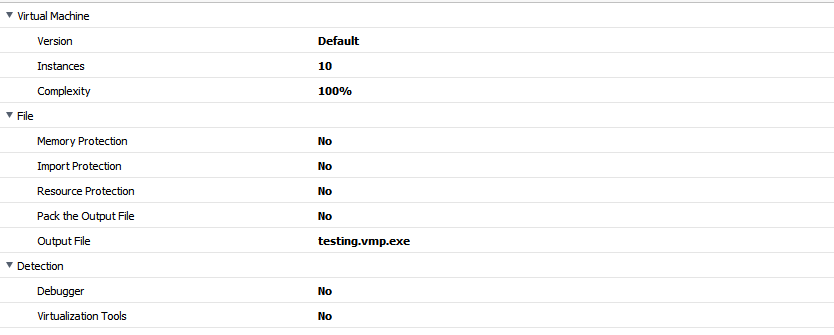
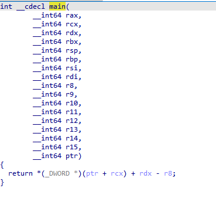

# Project Overview:
Mergen is a tool engineered to convert Assembly code into LLVM Intermediate Representation (IR).
This tool is designed for:
- The deobfuscation or devirtualization of obfuscated binary code
- The enhancement of the reverse engineering process, making it more efficient and effective, especially for complex software systems.

## Building

To build the project, take a look at [**docs/BUILDING.md**](https://github.com/NaC-L/Mergen/blob/main/docs/BUILDING.md).

## Core Objectives:

### Deobfuscation

### Devirtualization

### Optimization

## Diagram


## Examples
### Example #1 (VMProtect)

This is our target program

```cpp
struct test {
    int a;
    int b;
    int c;
};

int maths(test a, int b, int c) {
        return a.a  + b - c;
}
```


VMProtect settings, everything is turned off, we virtualize the function on ultra setting. (Tested versions 3.4.0-3.6.0 3.8.1) 




Here, we run mergen. First argument is the name of the file and the second argument is the address of the function. Look how simple it is to run. And we can compile the output so we can explore it using our favorite decompiler.


```llvm
; ModuleID = 'my_lifting_module'
source_filename = "my_lifting_module"

; Function Attrs: mustprogress nofree norecurse nosync nounwind willreturn memory(argmem: read)
define i64 @main(i64 %rax, i64 %rcx, i64 %rdx, i64 %rbx, i64 %0, i64 %rbp, i64 %rsi, i64 %rdi, i64 %r8, i64 %r9, i64 %r10, i64 %r11, i64 %r12, i64 %r13, i64 %r14, i64 %r15, ptr nocapture readonly %memory) local_unnamed_addr #0 {
entry:
  %stackmemory = alloca i128, i128 13758960, align 8
  %1 = trunc i64 %r8 to i32
  %2 = trunc i64 %rdx to i32
  %GEPLoadxd-5369456437- = getelementptr i8, ptr %memory, i64 %rcx
  %3 = load i32, ptr %GEPLoadxd-5369456437-, align 4
  %adc-temp-5370242400- = sub i32 %2, %1
  %realnot-5369532059- = add i32 %adc-temp-5370242400-, %3
  %stackmemory10243.sroa.55.1375304.insert.ext10255 = zext i32 %realnot-5369532059- to i64
  ret i64 %stackmemory10243.sroa.55.1375304.insert.ext10255
}

attributes #0 = { mustprogress nofree norecurse nosync nounwind willreturn memory(argmem: read) }
```

After compiling:




Now you might notice the registers are a little bit off. This is because of we dont follow the calling conventions, if we were to follow the calling conventions, function signature would look like this:
```llvm
define i64 @main(i64 %rcx, i64 %rdx, i64 %rdx, i64 %r8, i64 %r9 ...) 
```
So, we just adjust the function signature to look normally. If you have more questions about this part, I suggest you research [calling conventions](https://learn.microsoft.com/en-us/cpp/build/x64-calling-convention?view=msvc-170#parameter-passing) and [ABI](https://learn.microsoft.com/en-us/cpp/build/x64-software-conventions?view=msvc-170&source=recommendations#register-volatility-and-preservation).

## Example #2 (Branches/Jumptables)
So, lets say we have this code. VM's will take this, and turn into a jump table so its harder to find the branch.
```cpp
int maths(int a, int b, int c) {
    if (a > b)
        return a + b + c;
    else
        return a - b - c;
}
```

This would be a high level interpretation of it. If you want to see how it really works, you can check [this file](https://github.com/NaC-L/Mergen/blob/main/testcases/test_branches.asm).

```
...
next_handler = xxx;
if ( a-b > 0 )
  next_handler = yyy;
jump next_handler;
...

```
This is how it will look when Mergen is running, it will execute a _very_ simple dependency analysis to find the "key" value and ask you to select a possible value. 


Output will look like this:
```llvm
; ModuleID = 'my_lifting_module'
source_filename = "my_lifting_module"

; Function Attrs: mustprogress nofree norecurse nosync nounwind willreturn memory(none)
define i64 @main(i64 %rax, i64 %rcx, i64 %rdx, i64 %rbx, i64 %rsp, i64 %rbp, i64 %rsi, i64 %rdi, i64 %r8, i64 %r9, i64 %r10, i64 %r11, i64 %r12, i64 %r13, i64 %r14, i64 %r15, ptr nocapture readnone %memory) local_unnamed_addr #0 {
entry:
  %stackmemory = alloca i128, i128 13758960, align 8
  %0 = trunc i64 %r8 to i32
  %1 = trunc i64 %rdx to i32
  %2 = trunc i64 %rcx to i32
  %adc-temp-5369455735- = add i32 %1, %2
  %realadd-5370894038- = add i32 %adc-temp-5369455735-, %0
  %stackmemory28430.sroa.2082.1375248.insert.ext = zext i32 %realadd-5370894038- to i64
  ret i64 %stackmemory28430.sroa.2082.1375248.insert.ext
}

attributes #0 = { mustprogress nofree norecurse nosync nounwind willreturn memory(none) }
```

Now, lets see what happens if we choose the other path:


```llvm
; ModuleID = 'my_lifting_module'
source_filename = "my_lifting_module"

; Function Attrs: mustprogress nofree norecurse nosync nounwind willreturn memory(none)
define i64 @main(i64 %rax, i64 %rcx, i64 %rdx, i64 %rbx, i64 %rsp, i64 %rbp, i64 %rsi, i64 %rdi, i64 %r8, i64 %r9, i64 %r10, i64 %r11, i64 %r12, i64 %r13, i64 %r14, i64 %r15, ptr nocapture readnone %memory) local_unnamed_addr #0 {
entry:
  %stackmemory = alloca i128, i128 13758960, align 8
  %0 = trunc i64 %r8 to i32
  %1 = trunc i64 %rdx to i32
  %2 = trunc i64 %rcx to i32
  %3 = add i32 %1, %0
  %realnot-5370192942- = sub i32 %2, %3
  %stackmemory28817.sroa.3072.1375144.insert.ext = zext i32 %realnot-5370192942- to i64
  ret i64 %stackmemory28817.sroa.3072.1375144.insert.ext
}

attributes #0 = { mustprogress nofree norecurse nosync nounwind willreturn memory(none) }
```

We managed to restore the original logic for branches. Next step would be tying these two paths into one. I do believe using SwitchInst would be more effective for this.

### Example #3 (Themida 3.1.6.0 LION64 (Red) )
Our target program:


Themida settings (we only care about vms atm):


After vm:


Running Mergen:


Output code: [click here](docs/themida_output.ll)
So, why our result is not succesful as lifting a binary thats protected by vmp? 

Themida actively writes on .themida section. Unlike stack, we cant disregard these writes, because these values might be read by other stuff later.

But, we have a temporary solution to that. Remove all stores into .themida section. Since our program doesnt write into memory, [I just commented all the stores.](docs/themida_output_lazy_fix.ll) Now we are left with this:

```llvm
source_filename = "my_lifting_module"

define i64 @main(i64 %rax, i64 %rcx, i64 %rdx, i64 %rbx, i64 %rsp, i64 %rbp, i64 %rsi, i64 %rdi, i64 %r8, i64 %r9, i64 %r10, i64 %r11, i64 %r12, i64 %r13, i64 %r14, i64 %r15, ptr writeonly %memory) local_unnamed_addr #0 {
  %trunc = trunc i64 %r8 to i32
  %trunc1 = trunc i64 %rdx to i32
  %trunc2 = trunc i64 %rcx to i32
  %realadd-5369771371- = add i32 %trunc1, %trunc2
  %realadd-5369582686- = add i32 %realadd-5369771371-, %trunc
  %trunc457139 = zext i32 %realadd-5369582686- to i64
  ret i64 %trunc457139
}

attributes #0 = { mustprogress nofree norecurse nosync nounwind willreturn memory(argmem: write) }
```

## Current problems

### Automatically exploring branches and merging multiple paths into one program

### No built-in MBA solver

### Ideally should start running from exported entrypoint

# Getting in touch
Join our [Mergen Discord Server](https://discord.gg/e3eftYguqB) to trade ideas or just chatting in general.
